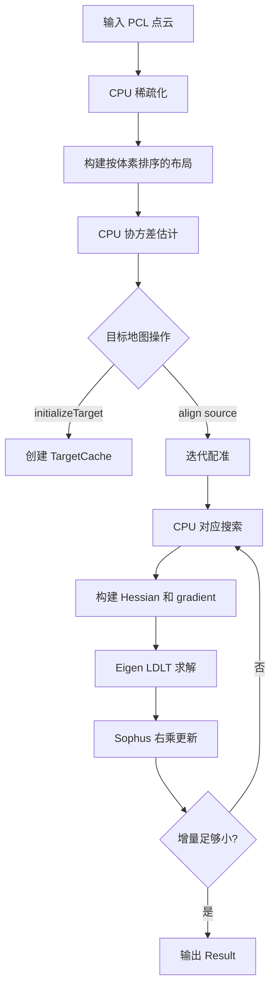

# GICP Algorithm Flow

本文档描述当前 `GICP` 的 CPU 实现、数据流和数值约定。稀疏化、协方差估计、对应搜索、法方程构建和位姿更新都在 CPU 上完成；实现不依赖 CUDA、`cuco`、CUB 或设备端数据结构。

实现位于以下文件：

- `include/perception/GICP/preprocess.hpp`：点云稀疏化、体素 key 与体素布局。
- `include/perception/GICP/GICP.h`：公开配置、结果和目标缓存定义。
- `source/GICP/GICP.cpp`：协方差估计、对应搜索、GICP 求解和目标地图操作。

## 1 数据对象

### 1.1 `VoxelKey`

`VoxelKey` 是三个整数组成的 CPU 体素坐标：

```text
(i, j, k) = floor(point / voxel_size)
```

它通过 `VoxelKeyHash` 用作 `std::unordered_map` 和 `std::unordered_set` 的 key。当前实现直接保存三个坐标，不进行位打包，因此没有 packed-key 的坐标范围或空 key 限制。

### 1.2 `SparsePoint`

`SparsePoint` 是稀疏化阶段的**中间对象**：

```cpp
struct SparsePoint
{
    Eigen::Vector3f position;
    VoxelKey key;
};
```

它只保存有限、通过最小间距和每体素容量检查的输入点。

### 1.3 `PointWithCovariance`

```cpp
struct PointWithCovariance
{
    Eigen::Vector3f position;
    Eigen::Matrix3f covariance;
    bool covariance_valid;
};
```

`covariance_valid` 表示局部邻域是否足以估计出数值可用的协方差。无效协方差不会阻止该点参与最近邻搜索，但在 GICP 权重中会触发单位阵回退。

### 1.4 `VoxelPointLayout`

`VoxelPointLayout` 保存按体素排序后的连续点数组：

```cpp
struct VoxelPointLayout
{
    std::vector<PointWithCovariance> points;
    std::vector<VoxelEntry> voxels;
    std::vector<VoxelKey> voxel_keys;
};
```

其中 `voxels[n] = {start, count}` 指向 `points` 中同一体素的连续区间：

```text
voxel n -> points[start ... start + count - 1]
```

`voxel_keys[n]` 与 `voxels[n]` 一一对应，目标缓存以该 key 到 `voxels` 下标的映射加速查询。

### 1.5 `TargetCache`

目标地图缓存保存在主机内存中：

```cpp
struct TargetCache
{
    std::unordered_set<VoxelKey, VoxelKeyHash> occupied_voxels;
    std::vector<PointWithCovariance> points;
    std::vector<VoxelEntry> voxels;
    std::unordered_map<VoxelKey, int, VoxelKeyHash> voxel_map;
};
```

- `occupied_voxels`：用于增量插入时跳过已有体素；
- `points`：目标点及其协方差；
- `voxels`：目标点的连续体素区间；
- `voxel_map`：`VoxelKey -> voxels` 下标，用于查询邻近目标体素。


## 2 总体流程




## 3 稀疏化与体素布局

### 3.1 `Preprocesser::makeSparseCloud()`

稀疏化按输入顺序遍历 PCL 点云，并对每个点执行：

1. 丢弃坐标为 `NaN` 或 `Inf` 的点；
2. 根据 `floor(position / voxel_size)` 得到体素 key；
3. 若该体素已经保留 `max(1, max_points_per_voxel)` 个点，丢弃该点；
4. 若该点与同体素已保留点的距离小于 `max(0.001 m, 0.1 * voxel_size)`，丢弃该点；
5. 否则保留为 `SparsePoint`。

最小间距仅在同一体素内检查，不会过滤跨体素边界但彼此很近的点。

### 3.2 `Preprocesser::makeVoxelPointLayout()`

保留点先按 `VoxelKey(i, j, k)` 的字典序排序；相同 key 的点维持原输入顺序。随后创建连续的 `points` 数组以及对应的 `{start, count}` 体素条目。新建的 `PointWithCovariance` 只含位置，协方差保持默认值且标记为无效，直到 `estimateCovariances()` 处理完成。


## 4 目标地图管理

### 4.1 初始化：`initializeTarget()`

目标点云经过稀疏化和体素布局后，先检查体素预算：

```text
max_target_voxels == 0
or layout.voxels.size() > max_target_voxels
    -> throw std::invalid_argument
```

通过检查后，CPU 为目标布局估计协方差，并构造 `TargetCache`。

### 4.2 增量插入：`insertTargetPoints()`

当前增量策略只接受此前未占用的完整体素，流程如下：

```text
if input empty:
    return

if no target:
    initializeTarget(input)
    return

if target voxel count already reaches max_target_voxels:
    return

sparse = makeSparseCloud(input)
remove every sparse point whose voxel already exists in occupied_voxels

new_layout = makeVoxelPointLayout(sparse)
if new_layout voxel count exceeds remaining budget:
    return

estimate covariance for new_layout
append new points and voxel entries to TargetCache
add new voxel keys to voxel_map and occupied_voxels
```

因此，该操作不会向已有体素补点，也不会替换旧点，更不会淘汰远处体素。若一批新点超出剩余体素预算，整批更新被拒绝，而不是部分插入。

新增点的协方差只使用此次 `new_layout` 中的邻居，不会把已有目标地图的点纳入该次估计；已有目标点的协方差也保持不变。


## 5 协方差估计：`estimateCovariances()`

协方差估计完全在 CPU 中执行。函数首先从本次 `VoxelPointLayout` 构建临时映射：

```text
VoxelKey -> layout.voxels index
```

然后逐点处理。

### 5.1 邻域搜索

对点所在体素 $(i, j, k)$，枚举每轴半径为 `covariance_voxel_radius` 的立方邻域：

$$
dx, dy, dz \in [-r, r]
$$

最多查询 $(2r + 1)^3$ 个体素。候选点包含当前点本身。候选数量超过

```text
max(3, min_covariance_neighbors, max_covariance_neighbors)
```

时，使用 `std::ranges::nth_element` 保留欧氏距离平方最小的一批候选点。该批候选不额外排序，因为后续均值和协方差计算不依赖顺序。

有效协方差所需邻居数为：

```text
max(3, min_covariance_neighbors)
```

CPU 实现不包含固定的协方差邻居容量上限。

### 5.2 样本协方差与归一化

对于 $N$ 个候选邻居，先计算均值：

$$
\mu = \frac{1}{N}\sum_i p_i
$$

再计算带对角线正则的样本协方差：

$$
\Sigma = \frac{1}{N - 1}\sum_i(p_i - \mu)(p_i - \mu)^T + \lambda I
$$

其中：

```text
lambda = max(1e-6, covariance_regularization)
```

若行列式非有限或绝对值不大于 $10^{-12}$，该点协方差无效。接着计算 `covariance.inverse().norm()`；若该值无效或不为正，协方差同样无效。有效协方差最终按逆矩阵范数归一化：

$$
\Sigma \leftarrow \Sigma \cdot \|\Sigma^{-1}\|
$$

并设 `covariance_valid = true`。


## 6 对应搜索：`findCorrespondences()`

每次迭代对每个源点执行：

1. 用当前 `Sophus::SE3d source_to_target` 将源点变换到目标坐标系；
2. 找到该位置所在体素；
3. 枚举该体素及其每轴相邻一层体素，即固定的 $3^3 = 27$ 个 key；
4. 通过 `TargetCache::voxel_map` 查找每个存在的目标体素；
5. 在这些体素的连续点区间中选择距离平方最小的目标点。

仅当距离平方严格小于

$$
\text{max\_correspondence\_distance}^2
$$

时才建立对应。未找到对应时 `target_index = -1`。

`max_correspondence_distance` 只影响欧氏距离阈值；它不会扩大固定为一层相邻体素的查询范围。


## 7 GICP 线性系统：`linearize()`

每一轮对应搜索后，CPU 遍历所有有效对应，构建一个稠密的 $6 \times 6$ Hessian 和 $6 \times 1$ gradient。

### 7.1 残差与协方差

设源点、目标点和当前变换分别为 $p_s$、$p_t$、$T = (R, t)$：

$$
r = T p_s - p_t
$$

当前代码的协方差回退规则是：

$$
C =
\begin{cases}
C_t + R C_s R^T, & C_s \text{ 有效且 } C_t \text{ 有效}\\
I + R C_s R^T, & C_s \text{ 有效且 } C_t \text{ 无效}\\
I, & C_s \text{ 无效}
\end{cases}
$$

因此，目标协方差只有在源协方差有效时才会参与当前实现的 GICP 约束。精度矩阵为：

$$
W = C^{-1}
$$

若 `W.allFinite()` 为假，该对应不参与后续求解。

### 7.2 Cauchy 鲁棒权重

马氏误差为：

$$
e = r^T W r
$$

当 `cauchy_kernel_scale = s > 0` 时，权重为：

$$
w = \frac{1}{1 + e / s^2}
$$

当 $s \leq 0$ 时，鲁棒核关闭，$w = 1$。

### 7.3 右扰动 Jacobian

内部位姿 `source_to_target` 是 `Sophus::SE3d`，采用右乘增量：

$$
T \leftarrow T\exp(\delta)
$$

其中：

$$
\delta =
\begin{bmatrix}
\rho_x & \rho_y & \rho_z & \omega_x & \omega_y & \omega_z
\end{bmatrix}^T
$$

前三维是源/LiDAR 系平移增量，后三维是源/LiDAR 系旋转向量。对 $T=(R,t)$ 和源点 $p_s$，Jacobian 为：

$$
J = \begin{bmatrix}R & -R[p_s]_\times\end{bmatrix}
$$

其中：

$$
[p_s]_\times =
\begin{bmatrix}
0 & -p_{s,z} & p_{s,y} \\
p_{s,z} & 0 & -p_{s,x} \\
-p_{s,y} & p_{s,x} & 0
\end{bmatrix}
$$

代码使用 `Sophus::SO3d::hat(source_point.position.cast<double>())` 构造源点反对称矩阵。

每个有效对应的贡献为：

$$
H_i = J^T w W J
$$

$$
g_i = J^T w W r
$$

并在 CPU 中直接累加：

$$
H = \sum_i H_i, \qquad g = \sum_i g_i
$$

`num_correspondences` 统计实际进入该累加的约束数，而不仅是最近邻命中的数量。


## 8 求解、更新与收敛

若没有有效约束，或未加权欧氏残差平方和非有限，当前轮失败并停止迭代。否则先计算：

$$
H' = H + \lambda I
$$

其中 $\lambda = \text{damping\_factor}$。这是固定的对角线阻尼，不是自适应 Levenberg-Marquardt 阻尼。

`Eigen::LDLT<Eigen::Matrix<float, 6, 6>>` 求解：

$$
H'\delta = -g
$$

若分解或求解失败，或 `right_increment.allFinite()` 为假，迭代停止。成功后由 Sophus 完成指数映射和右乘更新：

```cpp
source_to_target = source_to_target * Sophus::SE3d::exp(right_increment);
```

因此不再维护手写 Rodrigues 或 $SE(3)$ 左雅可比实现。

若同时满足：

$$
\|\rho\| < \text{convergence\_translation}
$$

和：

$$
\|\omega\| < \text{convergence\_rotation}
$$

则 `converged = true` 并停止迭代。


## 9 `align()` 调用流程

```text
if source cloud empty:
    throw std::invalid_argument

if target not initialized:
    throw std::runtime_error

result.transform = initial_guess
source_layout = preprocess(source)
record sparse source and target point counts

if source_layout or target map has no points:
    return result

source_points = estimateCovariances(source_layout)
source_to_target = Sophus::SE3d(initial_guess rotation, initial_guess translation)

repeat at most max_iterations times:
    system = linearize(...)
    solve(system.hessian + damping, system.gradient)
    if linearization or solve failed:
        stop
    write updated transform to result
    if increment is below both convergence thresholds:
        mark converged and stop

if at least one successful iteration completed and fitness is finite:
    mark converged
```

最后的宽松回退意味着 `converged` 不严格等价于“增量已低于阈值”：只要至少完成一次成功更新且 `fitness_score` 有限，结果也会标记为已收敛。

`fitness_score` 计算为最近一次构建法方程时有效约束的未加权欧氏残差平方均值：
$$
\text{fitness} = \frac{1}{N}\sum_i \|r_i\|^2
$$

它不是 RMSE、不是马氏误差，也不是 Cauchy 加权代价。该统计发生在本轮位姿更新之前，不会在最终更新后的位姿上重新评估。


## 10 输出结果与调用方验收

`GICP::Result` 包含：

- `converged`：是否满足严格阈值，或触发成功迭代后的宽松回退；
- `iterations`：成功完成位姿更新的次数；
- `num_source_points`：稀疏化后的源点数；
- `num_target_points`：当前缓存的目标点数；
- `num_correspondences`：最近一次构建法方程时的有效约束数；
- `fitness_score`：最近一次构建法方程时的平均欧氏残差平方；
- `transform`：从源点坐标系到目标地图坐标系的估计变换。

`Localization::alignICP()` 将 `mBasePose` 作为初始值传入，只有在以下条件都通过后才接受 `result.transform`：

```text
result.converged
result.num_correspondences >= config.min_correspondences
result.fitness_score <= config.max_fitness_score
```


## 11 CPU 性能特征

当前计算都在调用线程的 CPU 上执行，没有 GPU 上传、kernel launch 或异步设备任务。主要耗时来自：

1. 源点和初始目标的稀疏化、排序与体素布局构建；
2. 协方差估计中每点对 $(2r + 1)^3$ 个邻近体素的扫描；
3. 每轮对应搜索中每点对固定 27 个目标体素的扫描；
4. 每个有效对应的 $3 \times 6$ Jacobian、$6 \times 6$ Hessian 累加；
5. 至多 `max_iterations` 次 CPU 迭代。

`LDLT` 求解的是固定大小的 $6 \times 6$ 系统，通常不是主要瓶颈。性能主要受保留点数量、每体素点数、协方差搜索半径、实际邻居数以及迭代次数影响。


## 12 边界与后续改进方向

- `voxel_size` 同时影响稀疏化、协方差邻域和对应搜索的物理尺度，当前三个尺度尚未解耦。
- 对应搜索只查询一层相邻体素；单独增大 `max_correspondence_distance` 可能仍会漏掉更远体素中的候选。
- `insertTargetPoints()` 不补充已有体素，并且新点协方差不参考旧地图邻居。
- 目标地图只有 `max_target_voxels` 容量上限，没有空间裁剪或淘汰策略。
- 有效协方差的回退规则目前以源点协方差有效性为分支；若希望任一有效协方差均参与约束，需要调整该逻辑。
- 大面积平面或平行结构仍可能导致某些自由度约束不足；更可靠的初始位姿或运动先验能降低局部最优和错误对应风险。

轮速或其他里程计最直接的融合方式是提供更好的 `initial_guess`。若需将先验直接加入优化，则应在 CPU 端构建完 $H$、$g$ 后加入相应的先验项，再复用同一个 $6 \times 6$ `LDLT` 求解流程。
