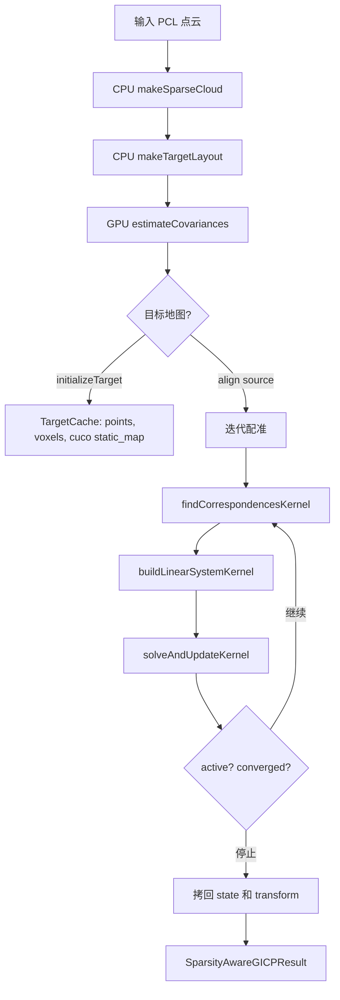

# SparsityAwareGICP Algorithm Flow

本文档整理当前 `SparsityAwareGICP` 的算法流程和实现边界。代码入口主要是：

- `SparsityAwareGICP::initializeTarget()`：初始化目标地图。
- `SparsityAwareGICP::insertTargetPoints()`：增量插入目标点。
- `SparsityAwareGICP::align()`：把当前源点云配准到目标地图。

当前实现是 CUDA 加速的稀疏 GICP。CPU 负责点云稀疏化、体素布局和数据准备；GPU 负责协方差估计、对应搜索、线性系统构建和位姿迭代更新。

当前文件分工：

- `source/LIO/SparsityAwareGICP.cu`：保留 GICP 主流程、CPU 稀疏化、体素布局、目标缓存和公开接口实现。
- `include/perception/LIO/detail/SparsityAwareGICPKernels.cuh`：声明内部 CUDA 数据结构、常量和 host wrapper。
- `source/LIO/SparsityAwareGICPKernels.cu`：实现 CUDA kernel 和 GPU helper，包括协方差估计、对应搜索、线性系统构建和求解更新。

`SparsityAwareGICPKernels.cuh` 仍是内部头文件，不安装、不作为公开 API 使用。GPU 细节放在 `perception::lio::detail` 命名空间中，主流程只调用 wrapper，不直接依赖 kernel launch 细节。

## 1 数据对象

### 1.1 HostVoxelKey

`HostVoxelKey` 是 CPU 侧体素坐标：

```text
(x, y, z) = floor(point / voxel_size)
```

它用于：

- CPU 侧稀疏化；
- CPU 侧按体素排序；
- 构建目标体素哈希表的 key。

GPU 侧不直接使用 `HostVoxelKey`，而是使用 `packVoxelKey(x, y, z)` 压成 `int64_t`。

`int64_t` 并不表示体素只有一个坐标，而是将三个整数坐标编码为一个标量 key，供
`cuco::static_map<int64_t, int>` 查询。每个坐标占用 21 bit：先加上 $2^{20}$ 的偏移量，
再保留低 21 bit，因此可无冲突地表示的每维坐标范围为：

```text
[-1,048,576, 1,048,575]
```

三个坐标合计使用 63 bit，位布局如下：

```text
| x: 21 bits | y: 21 bits | z: 21 bits | unused: 1 bit |
    62       42 41       21 20        0
```

对应实现为：

```cpp
return (packed_x << 42) | (packed_y << 21) | packed_z;
```

这种表示让 GPU 哈希表可以将一个体素坐标作为单个 key 比较和哈希，而无需在设备端为
三维结构实现相等比较、哈希函数和空 key。最高位未使用，因此打包结果非负，不会与
`std::numeric_limits<std::int64_t>::min()` 这个哈希表空 key 冲突。

### 1.2 SparsePoint

`SparsePoint` 是 CPU 稀疏化后的中间点：

```cpp
struct SparsePoint
{
    Eigen::Vector3f position;
    HostVoxelKey key;
};
```

它只存在于 CPU 上，用来生成 `TargetLayout`。

### 1.3 DevicePoint

`DevicePoint` 是 GPU 上使用的点结构：

```cpp
struct DevicePoint
{
    float x;
    float y;
    float z;
    float covariance[9];
    int covariance_valid;
};
```

协方差一开始为空，之后由 `estimateCovariancesKernel` 写入。

### 1.4 DeviceVoxelEntry

`DeviceVoxelEntry` 描述某个体素中的点在排序后点数组里的连续范围：

```cpp
struct DeviceVoxelEntry
{
    int start;
    int count;
};
```

目标点和源点都会先按体素排序，因此同一个体素内的点是连续的。

### 1.5 DeviceCorrespondence

`DeviceCorrespondence` 保存每个源点的最近目标点结果：

```cpp
struct DeviceCorrespondence
{
    int target_index;
    float transformed_x;
    float transformed_y;
    float transformed_z;
};
```

`target_index < 0` 表示没有找到有效对应点。

### 1.6 DeviceVoxelMap

`DeviceVoxelMap` 是目标地图驻留在 GPU 上的只读体素索引。它的实际类型由
`decltype(cuco::static_map{...})` 推导，等价于一个键和值类型分别为 `int64_t` 和 `int`
的固定容量哈希表：

```text
packed voxel key -> index into voxels
```

key 是 `packVoxelKey(x, y, z)` 生成的 packed voxel key；value 是该 key 对应的
`DeviceVoxelEntry` 在 `voxels` 数组中的下标。因此，kernel 先用相邻体素的坐标生成 key，
再查询 map，成功后就能读取 `voxels[value]` 给出的 `points` 连续范围。

定义中的配置含义如下：

- `std::size_t{2}`：仅用于 `decltype` 推导类型的最小示例容量；实际 `TargetCache` 会以
    `max_target_voxels * 2` 创建 map，预留约 $0.5$ 的负载因子以降低冲突。
- `empty_key{int64_t::min()}`：表示未使用的槽位。packed key 非负，所以不会与有效 key 冲突。
- `empty_value{-1}`：与空 key 配套的值哨兵；正常插入的 voxel 下标总是非负。
- `cuda::std::equal_to<int64_t>`：设备端 key 相等比较。
- `cuco::linear_probing<1, cuco::default_hash_function<int64_t>>`：使用默认哈希函数；发生哈希冲突时，
    以线性探测查找下一个槽位。

`static_map` 的容量创建后不可扩展，因此初始化前会检查目标体素数不超过
`max_target_voxels`，以保证插入不会超过预分配容量。


## 2. 总体流程



## 3. CPU 稀疏化：makeSparseCloud

`makeSparseCloud()` 遍历输入 PCL 点云，并执行三个过滤条件：

1. 丢弃非有限点：`NaN`、`inf`。
2. 每个体素最多保留 `max_points_per_voxel` 个点。
3. 同一体素内，点间距小于 `min_point_spacing` 的点会被丢弃。

伪代码：

```text
for point in cloud:
    if point is not finite:
        continue

    key = floor(point / voxel_size)
    voxel_points = occupied_voxels[key]

    if voxel_points.size >= max_points_per_voxel:
        continue

    if point is too close to any kept point in same voxel:
        continue

    keep point
```

注意：`min_point_spacing` 只检查同一体素内的点，不检查跨体素点对。


## 4. 体素布局：makeTargetLayout

`makeTargetLayout()` 将稀疏点按体素排序，并生成三个数组：

```cpp
TargetLayout
{
    std::vector<DevicePoint> points;
    std::vector<DeviceVoxelEntry> voxels;
    std::vector<std::int64_t> voxel_keys;
};
```

排序后，每个体素中的点在 `points` 中是连续区间：

```text
voxel i -> points[start ... start + count - 1]
```

这样 GPU 查询某个体素时，只需要通过哈希表找到体素 entry index，再读取连续的目标点范围。


## 5. 目标地图缓存：TargetCache

`initializeTarget()` 的流程：

```text
target PCL cloud
    -> makeSparseCloud
    -> makeTargetLayout
    -> 检查 max_target_voxels
    -> estimateCovariancesCuda
    -> TargetCache
```

`TargetCache` 持有：

- `host_points`：CPU 侧目标点，用于增量补点、空间裁剪和重建；
- `points`：目标点和协方差，GPU device vector；
- `voxels`：目标体素 entry，GPU device vector；
- `voxel_map`：`cuco::static_map<int64_t, int>`，从 packed voxel key 映射到 voxel entry index；
- `occupied_voxels`：CPU 侧集合，用于增量插入时过滤重复体素。

初始化时，如果目标体素数超过 `max_target_voxels`，会抛出 `std::invalid_argument`，避免 `cuco::static_map` 容量不足导致未定义行为。


## 6. 增量目标插入：insertTargetPoints

`insertTargetPoints()` 用于向已有目标地图合并新点。无裁剪中心的重载只更新地图；带
`pruning_center` 的重载还会按 `max_target_distance` 删除远处体素。

流程：

```text
if input empty:
    return

if no target:
    initializeTarget(input)
    return

sparse = makeSparseCloud(input)
merge points into existing voxels subject to min spacing and per-voxel capacity
remove complete voxels farther than max_target_distance from pruning_center
merged_layout = makeTargetLayout(merged points)
if merged_layout.voxels exceeds capacity:
    keep the closest max_target_voxels voxels around pruning_center

re-estimate covariance for the complete retained target
atomically replace target points, voxel layout, and cuco map
```

已有体素不再被冻结：只要满足 `min_point_spacing` 且未达到
`max_points_per_voxel`，新观测也可以加入已有体素。当前采用整图重建，因此新增点和旧点的
协方差都会基于裁剪后的完整目标重新计算。这样语义直接且不会留下失效邻接关系，但更新成本高于
FAR-LIO 只处理活动点并维护双地图的增量实现。

已有体素达到点数上限时，新点只有在能增大体素内最小点间距时，才会替换最接近点对中的一个
旧点；每体素上限为 1 时则保留更靠近体素中心的点。地图超过 `max_target_voxels` 时，带裁剪中心
的更新会保留离当前中心最近的体素，使新旧体素按空间相关性竞争容量。无裁剪中心的兼容接口仍在
超限时拒绝更新，因为它没有可靠的空间淘汰依据。

空间裁剪以调用者给出的 `pruning_center` 为球心，比较每个体素首个点与球心的距离，并整体删除
超出 `max_target_distance` 的体素。`TrailerLocalization` 使用当前配准位姿的 translation 作为
裁剪中心，同时裁剪用于发布的 PCL 地图。


## 7 协方差估计：estimateCovariancesKernel

每个 CUDA thread 处理一个点。

### 7.1 邻域搜索

对当前点，根据 `covariance_voxel_radius` 搜索邻近体素：

```text
for dx in [-r, r]:
  for dy in [-r, r]:
    for dz in [-r, r]:
      find voxel(base + delta)
      scan all points in that voxel
```

默认 `r = 2` 时，每个点最多查询：

```text
(2 * 2 + 1)^3 = 125 个体素
```

每个点维护最多 `max_covariance_neighbors` 个最近邻，当前 CUDA 实现上限为 64。

### 7.2 协方差计算

找到足够邻居后，先计算均值：

$$
\mu = \frac{1}{N}\sum_i p_i
$$

再计算样本协方差：

$$
\Sigma = \frac{1}{N - 1}\sum_i (p_i - \mu)(p_i - \mu)^T + \lambda I
$$

其中 `lambda = covariance_regularization`。

如果邻居不足、行列式异常或数值非有限，则该点协方差无效，后续 GICP 会退回更接近点到点 ICP 的约束。

当前实现最后会用逆矩阵范数相关量归一化协方差，以控制尺度。


## 8 对应搜索：findCorrespondencesKernel

每个 CUDA thread 处理一个源点。

输入：

- 源点 `device_source`；
- 目标点 `mTarget->points`；
- 目标体素 `mTarget->voxels`；
- 目标体素哈希表 `mTarget->voxel_map`；
- 当前估计变换 `device_transform`。

流程：

```text
for each source point:
    transformed = T * source
    base_voxel = floor(transformed / voxel_size)

    best_distance2 = max_correspondence_distance^2
    best_target = -1

    search neighboring target voxels within adjacent_voxels
    for each target candidate:
        distance2 = ||transformed - target||^2
        keep nearest target under threshold

    output DeviceCorrespondence
```

`adjacent_voxels` 控制体素搜索范围，`max_correspondence_distance` 控制欧氏距离阈值。增大距离阈值不会自动扩大体素搜索范围。

如果 `state->active == 0`，kernel 直接返回。这样收敛后仍然会有 kernel launch，但不再执行重计算。


## 9 线性系统构建：buildLinearSystemKernel

每个 CUDA thread 处理一个有效对应点，并累加局部 Hessian 和 gradient。

当前求解变量是一个 6 维 SE(3) 小量：

$$
\delta =
\begin{bmatrix}
\delta t_x & \delta t_y & \delta t_z & \delta \omega_x & \delta \omega_y & \delta \omega_z
\end{bmatrix}^T
$$

前三维是平移增量，后三维是旋转向量增量。因此每个残差对状态的 Jacobian 是 $3 \times 6$，每个点贡献的 Hessian 是 $6 \times 6$，gradient 是 $6 \times 1$。

### 9.1 残差

对源点 $p_s$ 和目标点 $p_t$：

$$
r = Tp_s - p_t
$$

### 9.2 GICP covariance

如果源点协方差有效：

$$
C = C_t + R C_s R^T
$$

其中：

- $C_s$：源点协方差；
- $C_t$：目标点协方差，如果无效则用单位阵；
- $R$：当前位姿旋转。

如果源点协方差无效，则直接使用单位阵。

### 9.3 鲁棒权重

使用 Cauchy 核：

$$
e = r^T C^{-1} r
$$

$$
w = \frac{1}{1 + e / s^2}
$$

其中 `s = cauchy_kernel_scale`。如果 `cauchy_kernel_scale <= 0`，则关闭鲁棒降权，`w = 1`。

### 9.4 Jacobian

当前位姿使用左乘 SE(3) 增量：

$$
T \leftarrow \exp(\delta)T
$$

Jacobian 为：

$$
J = \begin{bmatrix} I & -[Tp_s]_\times \end{bmatrix}
$$

其中 $[Tp_s]_\times$ 是 transformed source point 的反对称矩阵：

$$
[p]_\times =
\begin{bmatrix}
0 & -p_z & p_y \\
p_z & 0 & -p_x \\
-p_y & p_x & 0
\end{bmatrix}
$$

所以代码里：

```cpp
jacobian.block<3, 3>(0, 0) = Eigen::Matrix3f::Identity();
jacobian.block<3, 3>(0, 3) = -skewMatrix(transformed_source);
```

对应的就是：

```text
J = [I, -skew(transformed_source)]
```

局部法方程：

$$
H_i = J^T w C^{-1} J
$$

$$
g_i = J^T w C^{-1} r
$$

从维度上看：

```text
J^T          6 x 3
w C^{-1}    3 x 3
J            3 x 6
H_i          6 x 6

J^T          6 x 3
w C^{-1}r    3 x 1
g_i          6 x 1
```

最终所有点的贡献求和：

$$
H = \sum_i H_i
$$

$$
g = \sum_i g_i
$$

然后交给 `solveAndUpdateKernel` 求解一次位姿增量。

### 9.5 为什么 hessian_size 是 21

`hessian_size = 21` 是因为 6 维状态对应的 Hessian 是一个 $6 \times 6$ 对称矩阵。完整矩阵有：

$$
6 \times 6 = 36
$$

个元素。但 Hessian 满足：

$$
H_{ij} = H_{ji}
$$

因此只需要保存上三角或下三角即可。上三角元素数量为：

$$
6 + 5 + 4 + 3 + 2 + 1 = \frac{6(6 + 1)}{2} = 21
$$

代码里按上三角打包：

```cpp
int packed_index = 0;
for (int row = 0; row < 6; ++row)
{
    for (int col = row; col < 6; ++col)
    {
        thread_sum.values[packed_index++] += local_hessian(row, col);
    }
}
```

对应顺序是：

```text
0:  H00
1:  H01
2:  H02
3:  H03
4:  H04
5:  H05
6:  H11
7:  H12
8:  H13
9:  H14
10: H15
11: H22
12: H23
13: H24
14: H25
15: H33
16: H34
17: H35
18: H44
19: H45
20: H55
```

这样每个 block 少写 15 个 float，也减少了 CUB reduction 的通道数。读取时再恢复对称项：

```cpp
augmented[row][col] += value;
if (row != col)
{
    augmented[col][row] += value;
}
```

这不会改变数学结果，只是改变存储方式。

### 9.6 Block reduction

每个 thread 先在寄存器里累加 `LinearSystemPartial`，然后用 CUB 做 block 内归约。

当前 partial 布局是 29 个 float：

```text
0..20   Hessian 上三角，共 21 个
21..26  gradient，共 6 个
27      valid_count
28      squared_error_sum
```

因此这些常量的关系是：

```cpp
constexpr int hessian_size = 21;
constexpr int valid_count_offset = hessian_size + 6;        // 27
constexpr int squared_error_offset = valid_count_offset + 1; // 28
constexpr int linear_system_size = squared_error_offset + 1; // 29
```

也就是：

$$
21 + 6 + 1 + 1 = 29
$$

这里没有再保存 raw correspondence count。`valid_count` 表示真正通过对应检查、协方差求逆和数值有限性检查后，参与法方程的约束数量。

`squared_error_sum` 保存的是未加权欧氏残差平方和：

$$
\sum_i \|r_i\|^2
$$

它用于计算 `fitness_score`：

$$
fitness = \frac{1}{N}\sum_i \|r_i\|^2
$$

注意：fitness 不是 Cauchy 加权后的代价，也不是马氏误差均值。

只存 Hessian 上三角是因为 Hessian 对称。`solveAndUpdateKernel` 读取时会恢复完整 6x6 矩阵。

### 9.7 为什么先在线程内累加再做 CUB reduction

早期实现中，每个有效点会直接对 shared memory 中的 Hessian 和 gradient 做 `atomicAdd`。这样所有线程都会竞争同一组地址，尤其 Hessian/gradient 只有几十个通道，冲突很集中。

当前实现改成：

```text
每个 thread 在自己的 LinearSystemPartial 中累加
    -> CUB block reduction
    -> thread 0 写出该 block 的 partial
```

这样把大量 shared atomic 争用变成了规整的 block reduction，通常更适合这种“小向量、多样本求和”的问题。


## 10 求解和位姿更新：solveAndUpdateKernel

`solveAndUpdateKernel<<<1, 1>>>` 只使用一个 CUDA thread。

原因是这个阶段只处理一个很小的全局问题：

1. 汇总所有 block partial；
2. 得到一个 6x6 Hessian 和 6x1 gradient；
3. 解一个 6x6 线性系统；
4. 更新全局 transform。

如果 `grid_size = 1024`，需要汇总的标量数量也只是：

$$
1024 \times 29 = 29696
$$

再加上一个 6x6 高斯消元。这个规模远小于前面的点级对应搜索和协方差估计。使用单线程可以避免额外的二级归约 kernel、block 间同步问题和 host/device 往返。

法方程为：

$$
(H + \lambda I)\delta = -g
$$

其中 `lambda = damping_factor`。

代码中 `augmented[row][6]` 存的是右侧项。因为法方程右侧是 $-g$，所以汇总 gradient 时使用：

```cpp
augmented[row][6] -= partial[hessian_size + row];
```

随后对增广矩阵：

```text
[ H + lambda I | -g ]
```

做高斯消元，最终得到：

```text
delta = augmented[:, 6]
```

当前使用手写高斯消元求解。如果系统无效、pivot 太小或数值非有限，则 `state->active = 0`，本次 align 停止更新。


### 10.1 为什么加 damping_factor

`damping_factor` 相当于在 Hessian 对角线上加一个小正数：

$$
H' = H + \lambda I
$$

它的作用是：

- 降低 Hessian 病态或接近奇异时的数值风险；
- 让更新更保守；
- 在几何退化时避免过大的增量。

它不是完整的 Levenberg-Marquardt 自适应阻尼。当前实现中 `lambda` 固定，不会根据上一轮代价下降情况自动增减。

位姿更新使用 SE(3) 指数映射：

$$
T \leftarrow \exp(\delta)T
$$

其中 `delta[0..2]` 是平移增量，`delta[3..5]` 是旋转向量。

代码里没有调用外部李群库，而是手写了 SE(3) 指数映射中的 Rodrigues 部分：

$$
R_\delta = I + \frac{\sin\theta}{\theta}[\omega]_\times + \frac{1 - \cos\theta}{\theta^2}[\omega]_\times^2
$$

其中：

$$
    heta = \|\omega\|
$$

平移部分使用左雅可比形式：

$$
t_\delta =
\left(
I + \frac{1 - \cos\theta}{\theta^2}[\omega]_\times
+ \frac{\theta - \sin\theta}{\theta^3}[\omega]_\times^2
\right)\rho
$$

其中 $\rho = \delta[0..2]$，$\omega = \delta[3..5]$。

当 $\theta$ 很小时，代码使用泰勒展开近似，避免除以非常小的数：

```cpp
sin(theta) / theta              -> 1 - theta^2 / 6
(1 - cos(theta)) / theta^2      -> 1/2 - theta^2 / 24
(theta - sin(theta)) / theta^3  -> 1/6 - theta^2 / 120
```

最终左乘更新：

$$
T_{new} = T_\delta T
$$

这与线性化时使用的左扰动模型一致。

收敛条件：

```text
||delta_translation|| < convergence_translation
and
||delta_rotation|| < convergence_rotation
```

满足后：

```cpp
state->converged = 1;
state->active = 0;
```

`active` 和 `converged` 在 device state 中使用 `int` 而不是 `bool`，主要是为了 host/device 结构体布局更明确，并且以后若扩展成状态码或 atomic flag 更方便。


## 11 align() 调用流程

`align(source, initial_guess)` 的完整流程：

```text
result.transform = initial_guess

if source empty or no target:
    return result

source_sparse = makeSparseCloud(source)
source_layout = makeTargetLayout(source_sparse)

if source or target empty:
    return result

device_source = estimateCovariancesCuda(source_layout)
device_correspondences = allocate(source_size)
device_transform = upload(initial_guess)
device_state = default active state
device_partials = allocate(grid_size * linear_system_size)

for iteration in [0, max_iterations):
    findCorrespondencesCuda(...)
    buildLinearSystemCuda(...)
    solveAndUpdateCuda(...)

copy device_state and device_transform back to host
fill SparsityAwareGICPResult
```

注意：CPU 端仍固定提交 `max_iterations` 轮。GPU 端收敛后，搜索和线性系统 kernel 会因为 `active == 0` 直接返回，但 launch 开销仍然存在。


## 12 输出结果含义

`SparsityAwareGICPResult` 包含：

- `converged`：是否认为当前结果可用；
- `iterations`：实际完成的更新次数；
- `num_source_points`：稀疏化后的源点数量；
- `num_target_points`：目标缓存中的目标点数量；
- `num_correspondences`：参与线性系统的有效约束数量；
- `fitness_score`：有效约束的未加权欧氏残差平方均值；
- `transform`：源点到目标地图的估计变换。

当前 `converged` 语义有一个宽松回退：如果没有严格满足收敛阈值，但至少成功迭代过一次且 fitness 有限，也会返回 `converged = true`。调用方仍需要检查 `num_correspondences` 和 `fitness_score`。


## 13 TrailerLocalization 中的使用方式

调用方中大致是：

```text
mTrailerPose: trailer/template 在 truck frame 中的位姿
initial_guess = mTrailerPose.inverse()
result = mGicp.align(current_scan, initial_guess)
out_pose = result.transform.inverse()
```

也就是说：

- GICP 求的是当前扫描到 trailer template 的变换；
- 调用方保存的是 trailer template 到 truck frame 的位姿。

验收逻辑主要检查：

```text
result.converged
result.num_correspondences >= min_correspondences
result.fitness_score <= max_fitness_score
```

通过后才更新 `mTrailerPose`，并在成功对齐后更新目标地图。


## 14 性能关键点

当前主要计算开销来自：

1. 协方差估计：每点查询多个邻近体素并维护最近邻；
2. 对应搜索：每点查询目标邻近体素；
3. 每帧 source 侧 CPU 稀疏化、排序、上传和 device vector 分配；
4. 固定 `max_iterations` 次 kernel launch。

已经做过的优化包括：

- 搜索和 Hessian kernel 在 `active == 0` 时直接返回；
- 删除每轮 partial 清零；
- 用 CUB block reduction 替代 shared atomic 累加；
- Hessian 只存上三角；
- 删除 raw correspondence 统计；
- 删除目标 CPU 点云副本和部分无用字段。

继续优化时，优先考虑：

- source 侧 device buffer 复用；
- 协方差邻居容量特化，例如 16/32/64；
- 更轻量的源点协方差近似；
- 目标体素分布或 surfel 表示，减少点级对应搜索；
- 轮速里程计提供初值和运动先验，减少高速下错误对应。


## 15 与轮速里程计融合的入口

当前最自然的融合入口有两个。

### 轮速作为 GICP 初值

轮速积分给出相邻激光帧之间的相对运动，用来预测当前 `initial_guess`。这一步改动小，通常能减少高速时的错误对应。

### 轮速作为 6x6 法方程先验

在 `solveAndUpdateKernel` 汇总完激光 Hessian 和 gradient 后，可以追加轮速先验：

$$
H_{total} = H_{lidar} + H_{wheel}
$$

$$
g_{total} = g_{lidar} + g_{wheel}
$$

轮速通常只约束平面自由度，例如 $x, y, yaw$，不要硬约束 $z, roll, pitch$。

这条路线可以形成实用的紧耦合：激光点残差和轮速运动先验进入同一个 6x6 求解器。


## 16 需要特别注意的边界

- `voxel_size` 同时影响稀疏化、协方差邻域和对应搜索，目前三个尺度尚未解耦。
- `fitness_score` 是更新前最近一次对应集上的残差统计，不一定严格等于最终更新后位姿的残差。
- `insertTargetPoints()` 的新增点协方差不参考已有地图邻居。
- 目标地图只有容量上限，没有淘汰策略。
- `packVoxelKey()` 只为有限坐标范围设计，极端体素坐标会被 mask 截断。
- 大片平行侧壁会导致部分方向弱约束，轮速或运动先验可以帮助补足这些方向。
